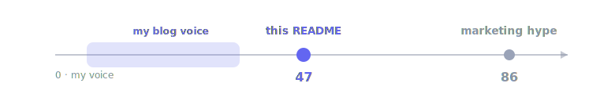

<p align="center">
  <picture>
    <source media="(prefers-color-scheme: dark)" srcset="assets/logo-dark.svg">
    
  </picture>
</p>

<h1 align="center">Timbro</h1>

<p align="center">
  <em>Keep your writing sounding like you — even when an LLM is doing the writing.</em>
</p>

<p align="center">
  
  
  
  
</p>

---

LLM prose drifts. Today's draft doesn't sound like last week's, and neither sounds like the human or the company it's published under. Timbro fixes the *consistency* problem: seed it with writing you've accepted as your voice, and it scores any draft for **how far** it sits from that voice and **which way** to revise it — in named features, without changing what it says.

Timbro puts a measurable voice target inside your AI agent.


## Why

- **You, consistently.** A personal blog or newsletter should sound like one person across years of posts — not like whichever model wrote each one.
- **A company on-brand.** Marketing, docs, and posts drift across authors and tools. Seed Timbro with your on-brand corpus and every draft gets measured against it.
- **An agent that self-corrects.** LLMs are fluent but stylistically inconsistent. Timbro gives an agent a *measurable target* and a *named direction*, so it can revise toward a voice instead of guessing.


## Numbers

This README was written by Claude (Opus 4.8). With Timbro you can see exactly how it scores against [my actual blog voice](https://nicolobrandizzi.com/blog/) — the same number your agent watches as it revises:

<p align="center">
  
</p>

It lands at 47 — outside my blog range (9–35): recognizably *not* my essay voice (it's code-heavy docs), but a world away from sales-speak at 86. And Timbro hands back the *direction* to close the gap: **more conjunctions, fewer abstract nouns, less code-block punctuation**. Scored against: [Horizon AI Fragmentation](https://nicolobrandizzi.com/blog/horizon-analysis/), [Teaching Machines to Think](https://nicolobrandizzi.com/blog/rl-reasoning-llm/), [The Digital Poisoners](https://nicolobrandizzi.com/blog/pravda-grooming/), [The SOTA Trap](https://nicolobrandizzi.com/blog/sota-trap/), [AI Gigafactories](https://nicolobrandizzi.com/blog/ai-gigafactories-tool/).

## How it works

Your agent runs one loop, and Timbro scores every turn of it:

```
score    → how far from your voice, and which way to move
edit     → revise toward the named direction
re-score → distance dropped AND meaning held?
repeat   → until the distance stops falling
```

Each score is three legible layers plus a guard:

- **Scalar — "how far"** — a pre-trained [StyleDistance](https://huggingface.co/StyleDistance/styledistance) embedding, scored by multi-modal **kNN**.
- **Direction — "which way"** — **POS-unigram** rates, z-scored against your corpus and weighted by each feature's R². Every move is a named habit.
- **Flow** — paragraph-embedding trajectory (speed, volume, circuitousness) + the Schimel "circle-back" (`cos(first, last)`).
- **Content guard** — semantic cosine via a *general* model (all-MiniLM): changes *how* it reads, never *what* it says.

## Install

### As a Claude Code plugin (one command)

```
/plugin marketplace add nicofirst1/timbro
/plugin install timbro@timbro
```

This installs the **skill** *and* wires up the **MCP tools** (`score_voice`, `accept_rewrite`) in one shot. It works immediately on a small **packaged sample voice** — ask Claude *"score this against the Timbro sample voice"* to see it run.

To use **your** voice, point the MCP server at your own corpus. Edit the `timbro` entry in your MCP config (or the plugin's `plugin.json`) to set absolute paths:

```json
"env": {
  "TIMBRO_EXEMPLARS": "/abs/path/to/your/exemplars",
  "TIMBRO_CONTRAST":  "/abs/path/to/your/contrast"
}
```

The POS model and the sample corpus both ship with the plugin — no manual download step.

### As a skill

Copy just the skill so the agent knows when and how to use Timbro:

```bash
cp -r skills/timbro ~/.claude/skills/        # personal, or .claude/skills/ per-project
```

Now ask Claude the same way — it runs Timbro, reads the direction, and proposes content-preserving edits.

### As an MCP server (Claude Code, Cursor, Windsurf, Claude Desktop, …)

```bash
# Claude Code
claude mcp add timbro \
  -e TIMBRO_EXEMPLARS=$PWD/data/exemplars \
  -e TIMBRO_CONTRAST=$PWD/data/contrast \
  -- uv run --directory $PWD timbro-mcp
```

Or drop this into any agent's `.mcp.json` / MCP settings:

```json
{
  "mcpServers": {
    "timbro": {
      "command": "uv",
      "args": ["run", "--directory", "/abs/path/to/timbro", "timbro-mcp"],
      "env": {
        "TIMBRO_EXEMPLARS": "/abs/path/to/timbro/data/exemplars",
        "TIMBRO_CONTRAST": "/abs/path/to/timbro/data/contrast"
      }
    }
  }
}
```

The agent gets two tools:

| Tool | Returns |
|---|---|
| `score_voice(text)` | `{distance, direction, flow}` |
| `accept_rewrite(original, revised)` | `{accepted, content_ok, similarity, distance_before, distance_after, improved}` |

### As a one-shot CLI

No server, no agent — just score a file:

```bash
uv run timbro score draft.md
cat draft.md | uv run timbro score -        # stdin
uv run timbro score draft.md --json         # raw payload
```

### From source (required for the MCP and CLI options above)

Requires Python ≥ 3.11 and [`uv`](https://docs.astral.sh/uv/).

```bash
git clone git@github.com:nicofirst1/timbro.git && cd timbro
uv sync     # pulls deps + the en_core_web_sm POS model (no manual spacy download)

uv run timbro score draft.md   # runs immediately on the packaged sample voice

# to use your own voice, bring a corpus (both dirs are gitignored — your writing stays private)
mkdir -p data/exemplars data/contrast
#   data/exemplars/  → posts that define your (or your company's) voice — 6+ pieces
#   data/contrast/   → other authors' posts (the "not-our-voice" set), optional but sharpens it

TIMBRO_EXEMPLARS=data/exemplars TIMBRO_CONTRAST=data/contrast uv run timbro score draft.md
uv run python eval/harness.py data/exemplars data/contrast   # confirm it separates your voice
```

The two sentence-transformer models download from Hugging Face on first use. Everything runs **local and CPU-only** at inference — no API calls.

## FAQ

**Do I need the contrast set?** No, but it sharpens the direction — without it, every feature looks equally informative.

**Will it work on one author / a whole company?** Both. The "voice" is whatever you put in `data/exemplars/`. Mixed registers (blogs + papers) are fine — the scorer is multi-modal.

**Can I keep several directions (academic vs. slop, clear vs. jargon)?** Yes — one folder pair per dimension, selected by env var. Keep them under `data/profiles/<name>/{exemplars,contrast}/` and point the env vars at the one you want for a given task:

```bash
P=data/profiles/academic
TIMBRO_EXEMPLARS=$P/exemplars TIMBRO_CONTRAST=$P/contrast uv run timbro score draft.md
```

No code, no flags — collect good/bad examples per dimension and swap the two paths. See `data/profiles/README.md`.

**Does it rewrite for me?** No, and that's deliberate. Timbro *measures*; your agent rewrites and Timbro judges the result (closer to voice **and** same meaning). Keeps the scoring honest and local.

## Layout

```
src/timbro/
├── core.py          # corpus → POS features + StyleDistance embedding → VoiceModel
├── flow.py          # paragraph trajectory, circle-back, order gates
├── rewrite.py       # content-preservation guard + accept-rewrite loop
├── report.py        # the shared {distance, direction, flow} payload
├── cli.py           # `timbro score`
└── mcp_server.py    # MCP wrapper: score_voice, accept_rewrite
skills/timbro/       # Claude Code skill
eval/harness.py      # LOO-AUC, permutation baseline, direction sign test
```
