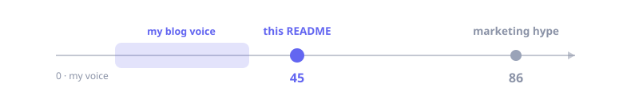

<p align="center">
  <picture>
    <source media="(prefers-color-scheme: dark)" srcset="assets/logo-dark.svg">
    
  </picture>
</p>

<h1 align="center">Timbro</h1>

<p align="center">
  <em>Keep what you publish sounding like you, or like your brand, with deterministic, offline checks that never call an LLM.</em>
</p>

<p align="center">
  <a href="https://github.com/nicofirst1/timbro/actions/workflows/ci.yml"></a>
  
  
  
</p>

---

<p align="center">
  
</p>

**LLM prose has a tell.** Dashes everywhere, "it's not X, it's Y", the _delve / tapestry / seamless_ vocabulary, a tidy wrap-up about the future. Readers feel it, but "sounds AI-written" is not something you can put in CI.

Timbro turns it into a check you can run. `timbro check --rubric slop` runs 21 deterministic detectors (regex and part-of-speech, no model, no network) and returns a verdict, four dimension scores, and the exact markers it found:

```
$ timbro check draft.md --rubric slop
slop: WARN (0.69)

diction      0.70
construction 0.70
rhythm       0.80
formatting   0.55

Top findings
- formatting: 2× em/en dashes
- diction: 12× AI-tell diction (delve, tapestry, seamless, robust, …)
- construction: signposting phrases, wrap-up phrases
```

Delete the flagged markers, re-run, and it reads `slop: PASS (1.00)`. Same meaning, no tells.

Why not ask an LLM whether a draft reads AI-generated? That would be one model grading another. The answer changes from run to run, every check is an API call, and it can't show you _which_ words tripped it. Every Timbro flag is a named marker you can see, cite, and remove. It runs locally on the CPU, gives the same answer every time, and is fast enough for a git hook.

## Install

### Any coding agent (npx)

One command installs the Timbro skill into ~40 coding agents (Cursor, Codex, Zed, aider, Cline, …), with nothing to clone:

```bash
npx skills@latest add nicofirst1/timbro
npx skills update    # later: pull the latest version
```

### Claude Code plugin

```
/plugin marketplace add nicofirst1/timbro
/plugin install timbro@timbro
```

The plugin ships the skill and a small **sample voice**, so it works right away (the first run downloads the spaCy model): ask Claude to _"score this against the Timbro sample voice"_. To use your own voice, ask Claude to run the `timbro-setup` skill for a guided walkthrough (see [Profiles](#profiles)).

### Command line

```bash
uvx timbro check draft.md    # no install; the first run downloads the spaCy model
```

Or install it with `uv tool install timbro` / `pip install timbro`, then drop the `uvx` prefix.

On Linux, install CPU-only torch first to skip the ~3 GB CUDA stack Timbro never uses (`pip install torch --index-url https://download.pytorch.org/whl/cpu`); macOS is unaffected.

### From source

Requires Python ≥ 3.11 and [`uv`](https://docs.astral.sh/uv/).

```bash
git clone git@github.com:nicofirst1/timbro.git && cd timbro
uv sync                        # dependencies plus the pinned spaCy model
uv run timbro score draft.md   # runs on the packaged sample voice
```

The two sentence-transformer models download from Hugging Face on first use. After that, everything runs locally with no API calls.

## Usage

```bash
timbro check draft.md                   # all rubrics: schimel + slop + density
timbro check draft.md --rubric slop     # AI-writing tells only
timbro score draft.md                   # distance from a voice + which way to revise
timbro score draft.md --profile myvoice # against a named profile
timbro accept draft.md revised.md       # closer to the voice, and the same meaning?
cat draft.md | timbro score -           # `-` reads stdin (score and check)
```

Add `--json` to `score`, `check`, `accept`, and `profiles list|env|diagnose|learn|sync` for the raw payload.

### Exit codes

`0` success, including a WARN or PASS check and an accepted rewrite; `1` user error (bad input, missing file, empty draft, unknown profile); `2` sync or environment failure (`profiles sync` hard failures; argparse usage errors also exit 2, with a `usage:` line); `3` verdict gate failure (a FAIL `check`, a rejected `accept`). Read the command's output for the reason.

## A positive target, not just a blocklist

Any regex list can tell you what to strip. Timbro also learns what your writing usually sounds _like_. Seed it with content you consider your voice (articles, docs, papers, newsletters), and it scores any draft for **how far** it sits from that voice and **which way** to revise it, in named features, without changing what it says.

- **You, consistently.** A blog or newsletter should sound like one person across years of posts, whichever tool helped write them.
- **A company, on brand.** Docs and posts drift across authors and tools. Seed Timbro with your on-brand corpus and measure every draft against it.
- **An agent that self-corrects.** Timbro gives an agent a _measurable target_ and a _named direction_, so it revises toward a voice instead of guessing.

## Numbers

Claude wrote this README. Here is how it scores against [my actual blog voice](https://nicolobrandizzi.com/blog/), the same number an agent watches as it revises:

<p align="center">
  
</p>

It lands at 45, outside my blog range (11–36): recognizably _not_ my essay voice, since it is mostly commands and code, but far from sales copy at 86. Timbro also names the way back: **fewer section dividers and symbols, more auxiliary verbs and pronouns**. The voice is 15 of my posts, including [Horizon AI Fragmentation](https://nicolobrandizzi.com/blog/horizon-analysis/), [Teaching Machines to Think](https://nicolobrandizzi.com/blog/rl-reasoning-llm/), [The Digital Poisoners](https://nicolobrandizzi.com/blog/pravda-grooming/), [The SOTA Trap](https://nicolobrandizzi.com/blog/sota-trap/), [AI Gigafactories](https://nicolobrandizzi.com/blog/ai-gigafactories-tool/).

## How it works

Your agent runs one loop, and Timbro scores every turn:

```
score    → how far from your voice, and which way to move
edit     → revise toward the named direction
re-score → did the distance drop AND the meaning hold?
repeat   → until the distance stops falling
```

Each score has three legible layers plus a guard:

- **How far:** a pre-trained [StyleDistance](https://huggingface.co/StyleDistance/styledistance) embedding, scored by multi-modal kNN.
- **Which way:** part-of-speech rates, z-scored against your corpus and weighted by how reliably each one marks your voice. Every move is a named habit.
- **Flow:** the paragraph-embedding trajectory (speed, volume, circuitousness) and Schimel's "circle-back" between the first and last paragraph.
- **Content guard:** semantic similarity from a _general_ model (all-MiniLM), so a revision changes _how_ it reads, never _what_ it says.

Timbro measures; it never rewrites. Your agent rewrites and Timbro judges the result, which keeps the scoring honest and local.

## The writing rubric

Voice answers _"does this sound like me?"_. The rubric answers _"is this good prose?"_, and needs no corpus. `timbro check` runs three deterministic rubrics, all built on spaCy parsing and counting, with no LLM as judge:

- **`schimel`:** about 30 checks from Joshua Schimel's _Writing Science_: buried subject–verb core, passive voice, comma splices, nominalizations, word-echo repetition, inconsistent terminology, defensive closings, significance without magnitude, and more.
- **`slop`:** AI-writing tells.
- **`density`:** jargon and padding.

Bare `check` runs all three with a worst-of verdict; `--rubric schimel,slop` narrows it. Each rubric returns per-dimension scores and a ranked findings list. It is recall-first, so a model consumer filters the occasional false positive. `uv run python eval/rubric_dashboard.py` shows each rule's hit rate on known-good prose, so noisy rules get demoted rather than deleted, and `uv run python eval/slop_benchmark.py` is a small repo-local smoke test of `slop` on LLM vs. human paragraphs (not independent validation: the human side is the corpus the rules were tuned on).

## Profiles

A profile is a named voice: `exemplars/` (writing that defines it, 6+ pieces) and an optional `contrast/` (writing that doesn't, which sharpens the direction). Timbro manages them for you:

```bash
timbro profiles init science-clarity --about "Plain-language scientific explanation."
timbro profiles add-file science-clarity notes/pvalue.md --to exemplars
timbro profiles add-file science-clarity sloppy-example.md --to contrast
timbro profiles learn science-clarity --draft draft.md --final final.md   # save an editing pair
timbro score draft.md --profile science-clarity,academic                  # compare several
```

Profiles live in `~/.timbro/profiles/<name>/`. `TIMBRO_HOME` moves `~/.timbro`, and `TIMBRO_PROFILE_ROOT` moves just the profiles. To skip profiles, point `TIMBRO_EXEMPLARS` / `TIMBRO_CONTRAST` at any two folders. `.tex` files are converted on ingest when `detex` is installed. The same operations are available from Python through `timbro.profiles` (`init_profile`, `add_file`, …).

### Syncing across machines

`timbro profiles sync` syncs the whole profile root with a **private** git repo (profiles hold private writing):

```bash
timbro profiles sync --init git@github.com:you/timbro-profiles.git   # first time on each machine
timbro profiles sync                                                 # routinely
```

On every machine after the first, run `--init` **before** creating profiles, so existing ones are pulled instead of recreated. Each sync commits local changes, merges `origin/main`, and pushes. It never rebases, never force-pushes, and never auto-resolves. Concurrent learn logs merge losslessly. If two machines edited the same file offline, sync prints `conflict in: <files>` and stops. Resolve it by hand:

```bash
cd ~/.timbro/profiles
git fetch origin main && git merge origin/main
# fix the listed files, then:
git add <files> && git commit && timbro profiles sync
```

`settings.json` (per machine, including the `no_log` switch for the learn log) is not synced.

Expected errors (a missing file, a bad profile name) print as one line. To see the full traceback behind one, set `TIMBRO_DEBUG=1` or `"debug": true` in `settings.json`.

## FAQ

**My voice uses em dashes. Won't `slop` nag me?** By default it flags against zero. Add `--profile <name>` to `check` and a tell is flagged only where the draft uses it more than you normally do. Without a profile it answers "is this AI-generated?"; with one, "is this driftier than my own writing?".

**Do I need a contrast set?** No, but without one every feature looks equally informative.

**One author or a whole company?** Either. The voice is whatever the exemplars contain, and mixed registers (blog posts and papers) are fine because the scorer is multi-modal.

## Layout

```
src/timbro/
├── __init__.py      # public API (VoiceModel, check_text, the profiles functions)
├── model/           # VoiceModel orchestrator and its two lenses
│   ├── __init__.py  # fit / score / axis_report, corpus reader, profile gating
│   ├── embedding.py # "how far": StyleDistance embedding kNN
│   ├── direction.py # "which way": part-of-speech rates
│   └── __main__.py  # smoke test (`python -m timbro.model`)
├── axes/            # standalone metric axes (register at import)
│   ├── tells.py     # AI-tell detectors; feed the slop rubric and the score direction
│   ├── hedge.py     # hedge/booster stance
│   ├── fw.py        # function words
│   ├── concreteness.py  # Brysbaert concreteness norms
│   ├── richness.py  # readability, lexical richness, entropy
│   ├── politeness.py    # politeness strategies (Tier C, manual)
│   └── markdown.py  # markdown structure
├── rubrics/         # `check` rubrics: schimel, slop, density
├── text.py          # splitting, markup stripping, the MiniLM embedder
├── flow.py          # paragraph trajectory, circle-back
├── rewrite.py       # content-preservation guard
├── report.py        # the score payload
├── metric.py        # Metric / Reference contract, registry, shared parse
├── priors.py        # declared priors and tuned constants
├── profiles.py      # named profiles: list, init, add-file, env, learn, diagnose, sync
├── profilelog.py    # per-profile learn log (runs.jsonl)
├── settings.py      # <TIMBRO_HOME>/settings.json
├── spacy_model.py   # the cached spaCy loader
├── cleanup/         # ingest-time LaTeX / paper cleanup
├── norms/           # vendored Brysbaert 2014 norms
├── sample/          # the packaged sample voice
└── cli.py           # score / check / accept / profiles
skills/              # the agent skill and the guided setup skill
eval/                # rubric dashboard, slop smoke test
```

## Contributing

See [CONTRIBUTING.md](CONTRIBUTING.md).
